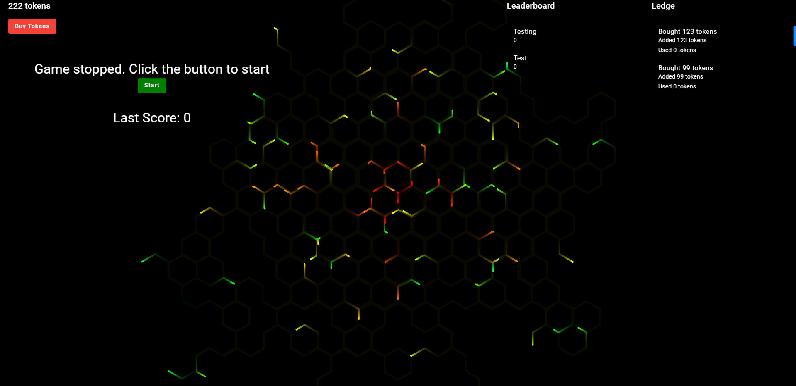

# LightForceArcade

LightForceArcade is a coding excercise submission that was part of my job application process for a position at LightForce. The goal was to create a simple fullstack web application that would allow users do multiple actions such as playing a game, buying and using tickets. It features some other features such as a leaderboard and a ledge.

## Try it out

You can try it out right now at [LightForceArcade](https://katiscoding.github.io/LightForceProject-Frontend/)

## Built With

- Angular
- Angular Material
- tsParticles

## Getting started

To get a local copy up and running follow these simple example steps.

### Requirements

- Node.js
- Angular CLI

### How to run locally

- Clone the repository
- Run `npm install` in the root directory
- Run `npm install -g @angular/cli` to install Angular CLI in case you don't have it
- Run `ng serve --open` to start the application
> Note: If you are running locally, it means you might as well want to run the backend as well. You can find the backend [here](https://github.com/KatIsCoding/LightForceProject-Backend)

## Author

👤 Fabrizio Gomez

- Github: [@KatIsCoding](https://github.com/KatIsCoding)
- Twitter: [@Fabrizio](https://twitter.com/fabriziogr211)

